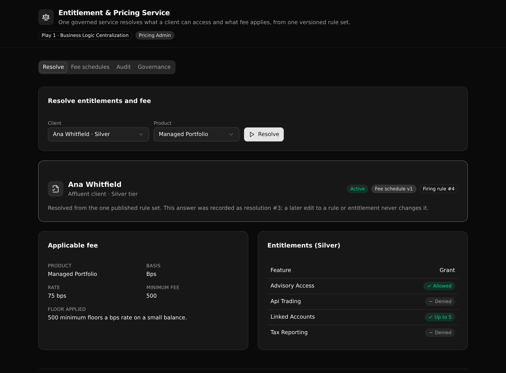

# Entitlement & Pricing Service

One governed service that resolves what a wealth client can access and what fee applies, from one versioned rule set, and records the exact tier rule and fee schedule version that decided it.



**7 tables · 14 API endpoints · 2 RBAC roles · authored in TypeScript with [@xanots/sdk](https://www.npmjs.com/package/@xanots/sdk)**

## What it demonstrates

A wealth platform asks two coupled questions in every client-facing app: what can this client tier access, and what fee applies. When each app keeps its own copy of the entitlement and pricing rules, the answers drift and no one can explain a past charge. This backend makes that logic one thing.

It is a **Play 1 (Business Logic Centralization)** proof for **wealth management**. The rules live in one API layer, versioned and auditable, instead of being re-encoded in every portal and advisor tool. A technical evaluator can read the whole decision in one place and see the rule that fired.

- **One resolve, one answer.** A single endpoint reads the client, refuses a suspended one, gathers the tier's entitlements, picks the fee rule from the currently published schedule, applies the minimum-fee floor for a bps rate, and returns the answer with the tier rule and schedule version that produced it.
- **Versioned pricing.** Fee schedules are versioned. Only one is published at a time. An admin creates a new draft (which clones the live rules), edits it, and publishes it. Publishing archives the previous version, so a re-resolve returns the new fee and the new version number.
- **An immutable audit.** Every resolve writes one row that snapshots the entitlements, the fee, the firing rule id, and the schedule version. A later edit never changes a past row, so a resolution stays explainable by the version that made it.
- **API-layer RBAC.** Two roles enforced at the endpoint, read fresh from the staff table on every call. This is middleware-style access control, not row-level security.

## Repo layout

```
entitlement-pricing-service/
├── xano/                    the Xano backend, authored in TypeScript
│   ├── index.ts             registers every table, API group, and endpoint
│   ├── seed-data.ts         canonical demo data (tiers, clients, rules, staff)
│   ├── tables/              tiers, clients, entitlements, fee_schedules, fee_rules, resolutions, staff
│   ├── api/                 one file per endpoint, plus _guards.ts (the RBAC preconditions)
│   └── xano.lock            pinned object identities (committed)
├── frontend/                React + Vite + Tailwind v4 + shadcn/ui
│   └── src/lib/api.ts        the one contract: paths and types derived from the query defs
└── docs/                    the landing page served by GitHub Pages
```

## API surface

Three API groups. The `resolve` surface is what a client-facing app calls, `admin` is the governed write surface, and `auth` mints a role token.

| Verb | Path | What it does | Access |
| --- | --- | --- | --- |
| GET | `/api:eps_resolve/seed` | Bootstrap: reload data if empty, mint the two demo tokens | Public |
| POST | `/api:eps_resolve/entitlements-and-fee` | The governed resolve, plus an audit write | Service |
| GET | `/api:eps_resolve/tier-grants/{tier_code}` | Every entitlement a tier grants | Service |
| GET | `/api:eps_resolve/resolution/{resolution_id}` | One past resolution with its firing rule | Service |
| GET | `/api:eps_resolve/resolutions` | The audit log, newest first | Service |
| GET | `/api:eps_resolve/clients` | The client directory | Service |
| GET | `/api:eps_resolve/tiers` | The tiers, ranked | Service |
| GET | `/api:eps_admin/fee-schedules` | Every schedule version with its status | Admin |
| GET | `/api:eps_admin/fee-rules` | The fee lines under one version | Admin |
| POST | `/api:eps_admin/fee-schedule` | Create a draft version (clones the published rules) | Admin |
| POST | `/api:eps_admin/fee-schedule/publish` | Publish a draft, archive the current published one | Admin |
| POST | `/api:eps_admin/fee-rule` | Upsert a fee line on a draft (published is immutable) | Admin |
| POST | `/api:eps_admin/entitlement` | Upsert a tier entitlement | Admin |
| POST | `/api:eps_auth/login` | Verify a credential and mint a role token | Public |

**Service** endpoints need an app-service or pricing-admin token. **Admin** endpoints need a pricing-admin token. A call without the required role is refused at the endpoint (401 without a token, 403 with the wrong role).

## Quick start

```
git clone https://github.com/xano-scratch/entitlement-pricing-service
cd entitlement-pricing-service
npm install
npx xanots login
npm run xano:deploy
```

`npm run xano:deploy` builds the frontend, deploys the backend and the static site to a fresh, auto-expiring Xano environment, self-seeds it, and prints the live URL. Open the URL and the Resolve tab is populated right away.

To run the frontend against that environment locally: `npm run dev`, with `VITE_XANO_HOST` set to the printed backend URL in a `.env.local` file.

## Demo accounts

Seeded for the throwaway environment (safe to publish here, hashed on write by the password column):

| Role | Email | Password |
| --- | --- | --- |
| pricing-admin | `admin@demo.test` | `pricing-demo-2026` |
| app-service | `service@demo.test` | `service-demo-2026` |

The Resolve, Fee schedules, Audit, and Governance tabs cover the whole flow. On the Governance tab, switch roles and run the access check to watch the API return 401, 403, and 200 for the same admin endpoint.

## The demo flow

1. **Resolve** a client and a product. See the entitlements grid, the fee (basis, rate, and the minimum-fee floor), and the exact tier rule and schedule version that fired.
2. On **Fee schedules**, create a new draft version. It clones the published rules. Edit one rule (say, lower a tier's managed-portfolio rate), then publish it.
3. Back on **Resolve**, run the same client again. The fee is the new one, under the new version number.
4. On **Audit**, open the earlier resolution. Its snapshot still shows the old version, unchanged. That is the point: a past answer stays explainable by the rule that made it.

## FAQ

**Is this row-level security?** No. Access is controlled at the API layer. Each protected endpoint reads the caller's role from the staff table and decides whether to run. There is no per-row policy in the database.

**Where does the fee math live?** In one endpoint, `resolve/entitlements-and-fee`. Every client-facing app calls it instead of re-encoding the rules, so pricing is defined once.

**How are past decisions kept stable?** Each resolve writes a `resolutions` row that snapshots the answer, including the firing rule id and the schedule version. Edits to rules or entitlements never touch a past row.

**Can I adapt it?** Yes. Change the tiers, features, products, and fee rules in `xano/seed-data.ts`, adjust the schema in `xano/tables/`, and redeploy. The frontend types follow the query defs, so a change surfaces at compile time.

## Notes

Built with XanoTS. The entitlement and pricing rules live in one versioned, auditable API layer. Access is controlled at the API layer by role, not row-level security. The live preview runs on a disposable environment with seeded demo data; redeploy for fresh links.
